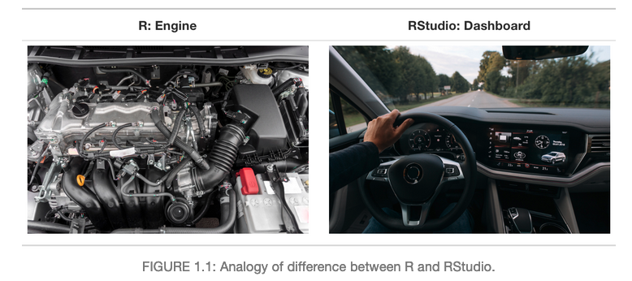
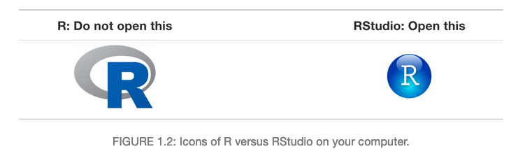
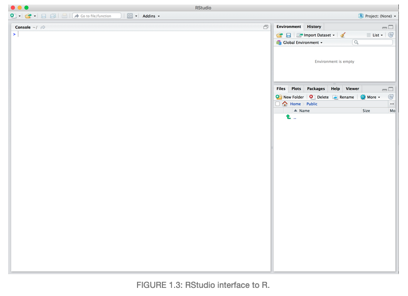
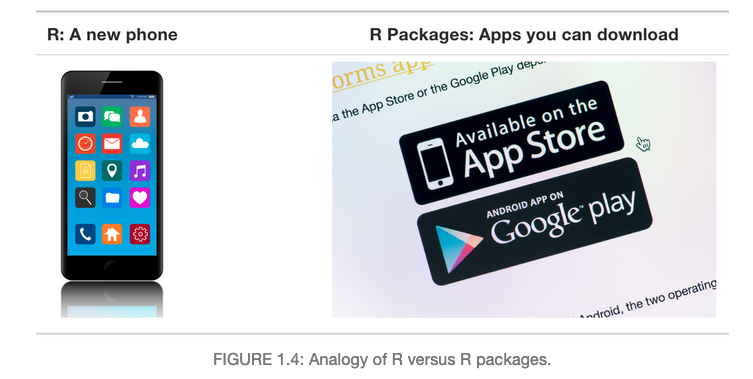
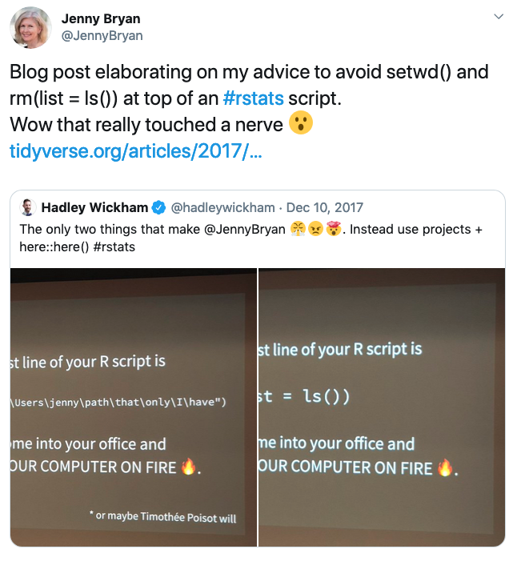
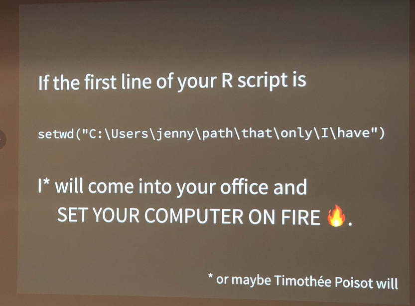

```{r setup, include=FALSE}
knitr::opts_chunk$set(echo = TRUE)
```

## Couple of Housekeeping things

While you are waiting have you done the prerequisites on your computer?

1. install latest version of R

2. install latest version of Rstudio

3. install packages
```{r}
#install.packages(tidyverse)
#install.packages(readxl)
```
** If you are having trouble let one of us know **

4. fill out the form:
https://forms.gle/QnhdsYXsyysj5TFM8

# Your instructors
- We run the R Study Group at Koerner Library from 1-2 on Wednesdays in this room
Jasmine
Arnav
Travis
Matt

## Workshop structure
4 parts
- with challenges to practice your knowledge
- ask lots of questions!

We will be live coding so follow along!
- the best way to learn is to try it yourself onyour own computer

## How to use the stickies
Instead of having your hand up and coding one handed we have this system instead
Red - help!
Green - Good
- when we are not teaching we will act as helpers so put up a red stickie if you need our help

## What are R and RStudio?

For this workshop, we will be using R via RStudio.

You can think of R like a car's engine, while RStudio is like a car's dashboard.

* R is the programming language that runs computations
* RStudio is an integrated development environment (IDE) that provides an interface by adding convenient features and tools.



So what this means is that, just as we don't drive a car by interacting directly with the engine but rather by interacting with the car's dashboard, we won't be using R directly.

Instead, we will be using the RStudio's interface.



After you open RStudio, you should see the following 3 panels:

* console,
* files,
* and environment.


## Code basics
- typing into the console then pressing enter, R will compute immediately
- typing into an R script will allow you to re-run your code over and over (reproducible)
- workflow is usually: 

(1) type your code out in R script
(2) send pieces of code to the console to be evaluated
(3) debug (aka - fix your mistakes) and repeat


- shortcuts to run code in R scripts *Mac* `cmd + enter` *Windows* `control + enter`
```{r}
1 + 2 # do basic math
print("hello") # displays text - sends it into the console
```

### Commenting
using the # symbol - not read by R
- use this to take notes during the workshop

### Assignment <- 
- "Giving your information a name"
- So you can access the material you computed later
- make sure to use informative names! will save you later
- try to avoid names that start with numbers or special characters
```{r}
a <-  1 + 2 * 3 / 4 ^ 5
b <- "hello"
a <-  3
```

### Types
RStudio will highlight these (syntax highlighting)
- these are only some commonly used types, you will encounter some others later in this workshop
```{r}
"abc"# Character (always in quotations)
42 # Numeric 
3.14 # Double 
TRUE  && FALSE # Logical
NA # null - NA

#check your type by using a function
str(a)
```

Know your types! It will be important when troubleshooting later (somehthings you can do with some but not with others)

### Functions
base R comes with some functions like `str()`
```{r}
sum(1,2,3) #adds all the numbers
mean(1,2,3)
```

#### Getting Help
##### 1. Help documentation
- look at the description, usage, arguments and scroll to the bottom for examples
```{r}
help(str)
```

##### Mini challenge
try loking at the help documentation for `paste`
- read how it works and try using it
- what does it do?

##### Online help
R for data science book https://r4ds.had.co.nz/
Google & Stackoverflow `combine two characters in R`

## What are R packages?
But what if you want to do more?

R packages extend the functionality of R by providing additional functions, data and documentation

* Think of R packages like apps that you can download onto a mobile phone
* You can get R packages from CRAN
* Or bioinformatics related R packages from bioconductor



So let's continue with this analogy: Let's say you've purchased a new phone (brand new R/RStudio install) and you want to take a photo (do some data analysis) and share it with your friends and family. So you need to:

1. Install the app.
2. Open the app.

This process is very similar when you are using an R package. You need to:

1. Install the pacakge: Most packages are not installed by default when you install R and RStudio. You will only need to install it again when you need to update it to a newer version.

```{r eval = FALSE}
install.packages("tidyverse")
```


2. "Load" or open the package: Packages are not loaded by default when you start RStudio on your computer. So you need to "load" each package you want to use every time you start RStudio.

```{r eval = FALSE}
library(tidyverse)
```

See [ModernDive Chapter 1](https://moderndive.com/1-getting-started.html) for further reading.


## Workspace and .RData

One day you will need to quit R, go do something else and return to your analysis later.

One day you will be running multiple analyses in R and you want to keep them separate.

One day you will need to bring data from the outside world into R and present results and figures from R back out to the world.

So how do you know which parts of your analysis is "real" and where does your analysis "live"?


### Where am I? (Working Directory)

Working directory is where R will look, by default, for files you ask it to load or to save.

You can explicitly check your working directory with:

```{r}
getwd()
```

It is also displayed at the top of the RStudio console

### What if I don't like where my current working directory is?


DO NOT USE `setwd` unless you want Jenny Bryan to set your computer on fire!





So what's wrong with:

```{r eval=FALSE}
setwd("/Users/amy/fuzzy_alpaca/cute_animals/foofy/data")
df <- read.delim("raw_foofy_data.csv")
p <- ggplot(df, aes(x, y)) + geom_point()
ggsave("../figs/foofy_scatterplot.png")
```

The chance of the `setwd()` command having the desired effect - making the file paths work - for anyone besides its author is 0%. It might not even work for the author a year or two from now. So essentially your data analysis project is not self-contained and protable, which makes recreating the plot impossible.

Read more here: https://www.tidyverse.org/articles/2017/12/workflow-vs-script/


### Suggestions on how to organize your data analysis:

Typically, I organize each data analysis into a project using RStudio Project. I tend to have a directory each for:

* raw data
* processed data
* output or figures
* scripts

### Rprojects!
- saves you from having to worry about working directories
- make a new project (upper right)

#### what it is
- An Rstudio innotation that makes a file in your folder called .Rproj 
- This will tell R to look there as your current working directory
- This helps with organizing your work!

#### set a new Rproject as your downloaded file
1. go to: https://tinyurl.com/y2qfb2pk
2. click the green button
3. save it somewhere you can access later 
4. click the top right hand side witht he blue cube
5. click new project
6. click existing directory
7. navigate to the directory to were you saved the downloaded file from before