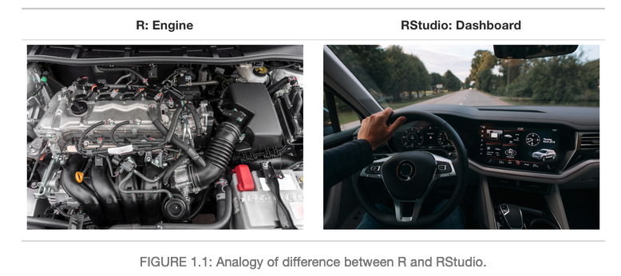
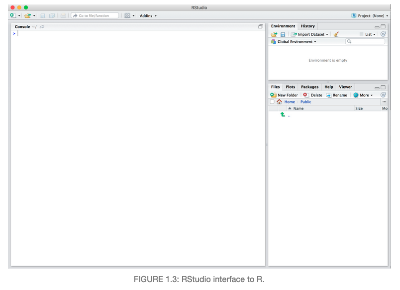
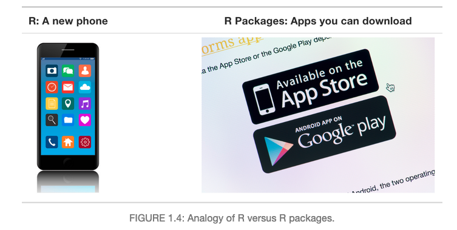
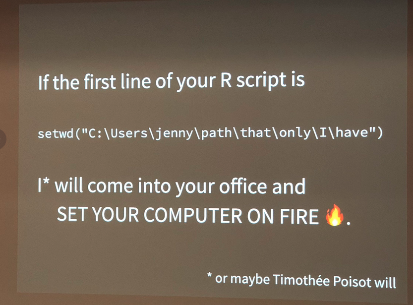

```{r setup, include=FALSE}
knitr::opts_chunk$set(echo = TRUE)
```

## What are R and RStudio?

For this workshop, we will be using R via RStudio.

You can think of R like a car's engine, while RStudio is like a car's dashboard.

* R is the programming language that runs computations
* RStudio is an integrated development environment (IDE) that provides an interface by adding convenient features and tools.



So what this means is that, just as we don't drive a car by interacting directly with the engine but rather by interacting with the car's dashboard, we won't be using R directly.

Instead, we will be using the RStudio's interface.


After you open RStudio, you should see the following 3 panels:

* console,
* files,
* and environment.



## What are R pakcages?
R packages extend the functionality of R by providing additional functions, data and documentation

* Think of R packages like apps that you can download onto a mobile phone
* You can get R packages from CRAN
* Or bioinformatics related R packages from bioconductor



So let's continue with this analogy: Let's say you've purchased a new phone (brand new R/RStudio install) and you want to take a photo (do some data analysis) and share it with your friends and family. So you need to:

1. Install the app.
2. Open the app.

This process is very similar when you are using an R package. You need to:

1. Install the pacakge: Most packages are not installed by default when you install R and RStudio. You will only need to install it again when you need to update it to a newer version.

```{r eval = FALSE}
install.packages("tidyverse")
```


2. "Load" or open the package: Packages are not loaded by default when you start RStudio on your computer. So you need to "load" each package you want to use every time you start RStudio.

```{r eval = FALSE}
library(tidyverse)
```

See [ModernDive Chapter 1](https://moderndive.com/1-getting-started.html) for further reading.


## Workspace and .RData

One day you will need to quit R, go do something else and return to your analysis later.

One day you will be running multiple analyses in R and you want to keep them separate.

One day you will need to bring data from the outside world into R and present results and figures from R back out to the world.

So how do you know which parts of your analysis is "real" and where does your analysis "live"?


### Where am I? (Working Directory)

Working directory is where R will look, by default, for files you ask it to load or to save.

You can explicitly check your working directory with:

```{r}
getwd()
```

It is also displayed at the top of the RStudio console

### What if I don't like where my current working directory is?


DO NOT USE `setwd` unless you want Jenny Bryan to set your computer on fire!




So what's wrong with:

```{r eval=FALSE}
setwd("/Users/amy/fuzzy_alpaca/cute_animals/foofy/data")
df <- read.delim("raw_foofy_data.csv")
p <- ggplot(df, aes(x, y)) + geom_point()
ggsave("../figs/foofy_scatterplot.png")
```

The chance of the `setwd()` command having the desiered effect - making the file paths work - for anyone besides its author is 0%. It might not even work for the author a year or two from now. So essentially your data analysis project is not self-contained and protable, which makes recreating the plot impossible.

Read more here: https://www.tidyverse.org/articles/2017/12/workflow-vs-script/


### Suggestions on how to organize your data analysis:

Typically, I organize each data analysis into a project using RStudio Project. I tend to have a directory each for:

* raw data
* processed data
* output or figures
* scripts


