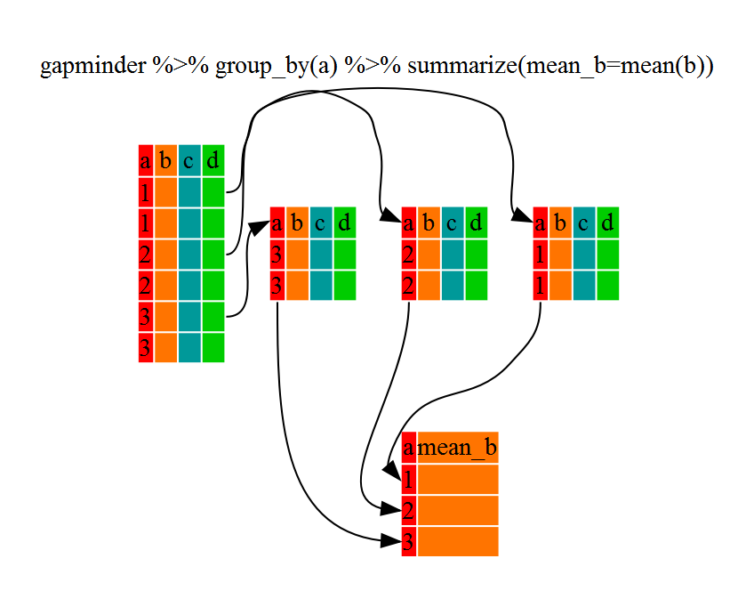

```{r setup, include = FALSE}
knitr::opts_chunk$set(echo = TRUE, message = FALSE, warning = FALSE, comment = "")
```

***

<br>

> These materials have been taken from the Software Carpentry: R Novice Lesson.
You can find the original materials
[here](https://github.com/swcarpentry/r-novice-gapminder)

<br>

This lesson will cover some basic functions that can be used to manipulate data
in R. Again, we will be using the gapminder data set, which includes country
information on GDP, population, etc.

<br>

There are five main functions we'll be talking about today, each allowing us to
manipulate data frames. These five functions are:

* `select()`  --  Choose columns (variables or attributes) from our data frame
* `filter()`  --  Choose rows (samples or observations) from our data frame
* `mutate()`  --  Create new columns, based on existing ones
* `group_by()`  --  Group rows based on a particular column/value within that column 
* `summarize()`  --  Perform some function on the grouped data
* `left_join()` -- Combine two tables based on a shared column

<br>

If you haven't already, make sure you have `dplyr()` and `gapminder()` installed
and loaded with the following commands:

```{r}
# Download the packages
# install.packages(c("tidyverse", "gapminder"))

# Load the packages for use
library(tidyverse)
gapminder <- read.csv("../data/gapminder_data.csv")
```

<br>

Let's take a quick look at our data frame to remind ourselves of its structure.
We do this using the `head()` command, which will display the first 10 rows
(given by `n = 10`) of our data frame.
```{r}
head(gapminder, n = 10)
```

<br>

## Quick aside on tibbles and data frames
In R, one of the main types of objects/variables we're going to be working with is a **data frame**. This is much like a table you would view in Excel, where column represent variables or measures and 

<br>

## Choose Columns: select

The first function we'll be using is `select()`. This function let's us pick
columns from our data frame, based on name (e.g. year) or by index (e.g. 3).


Let's try using `select()` to pick out a few columns: "country", "year",
"lifeExp", and "pop". We'll be assigning these columns to a new data frame,
`gapminder_select`. Then we'll use `head()` to see if it worked.

```{r}
# select() code here
gapminder_select <- select(gapminder, country, year, lifeExp, pop)

# Check the data frame
head(gapminder_select, n = 10)
```

<br>

As you can see, our new data frame contains only a subset of the columns from
the original data frame, based on the names we provided in the `select()`
command.

<br>

Here we'll also introduce another great feature of `dplyr()`: the pipe (
**%>%** ). This symbol sends or pipes an object (e.g. a data frame like
gapminder) INTO a function (e.g. `select()`).

So, the above `select()` command can be rewritten as follows (NOTE: the "." is a
placeholder, which represents the object being piped). Again, we can check our
result using `head()`.

```{r}
# select() using pipe syntax
gapminder_pipe <- gapminder %>% select(., country, year, lifeExp, pop)

head(gapminder_pipe, n = 10)
```

<br>

We can actually simplify the above command further - dplyr's functions such as
`select()` are smart enough that you don't actually need to include the "."
placeholder, as shown below.


```{r}
# select() using pipe syntax w/out a placeholder
gapminder_pipe2 <- gapminder %>% select(country, year, lifeExp, pop)

head(gapminder_pipe2, n = 10)

```

<br>

### Challenge 1
Using the `select()` command and pipe (` %>% `) notation, pick the following
columns from the `gapminder` data frame, assign them to a new variable (we'll
use **x**), and display the results using `head(x, n = 10)`. Columns to choose
are:

* continent
* GDP per capita
* life expectancy
* year

```{r, eval = FALSE}
# Answer here:
x <- select()
```

<br>

## Choose Rows: filter

So we've covered selecting columns, but what about rows? This is where
`filter()` comes in. This function allows us to choose rows from our data frame
using some logical criteria. An example is filtering for rows in which the
country is Canada. This can also be applied to numerical values, such as the
year being equal to 1967, or life expectancy greater than 30.

NOTE: In R, equality (e.g. country is Canada, year is 1967) is done using a
double equals sign (`==`).


Let's go through a couple examples. 

```{r}
# Filter rows where country is Canada
gapminder_canada <- gapminder %>% filter(country == "Canada")

head(gapminder_canada, n = 10)
```

<br>

Let's try another one, this time filtering on life expectancy above a certain
threshold:

```{r}
# Filter for rows where life expectancy is greater than 50
gapminder_LE <- gapminder %>% filter(lifeExp > 50)

head(gapminder_LE, n = 10)
```

<br>

We can also filter with multiple arguments, each separated by a comma:

```{r}
# filter() for Canada and life expectancy greater than 80
gapminder_C_LE <- gapminder %>% filter(country == "Canada", lifeExp > 80)

head(gapminder_C_LE, n = 10)
```

<br>

### Challenge 2
Use `filter()` to choose data for African countries, from the year 1980 and
onwards.

```{r, eval = FALSE}
# Challenge 2 code here
x <- filter()
```

<br>

## Create New Columns: mutate()

Let's say we now want to calculate the GDP in billions, which is done by
mutiplying the GDP per capita by the population, then dividing by 1 billion (1 *
10^9). `mutate()` will perform this calculation on each row in the data frame,
one row at a time (i.e. row-wise). The code below will calculate the GDP in
billions:

* `gdpPercap * pop / 10^9`

```{r}
# Use mutate() to calculate GDP in billions
gapminder_gdpBil <- gapminder %>% mutate(gdp_billion = gdpPercap * pop / 10^9)

head(gapminder_gdpBil, n = 10)
```

<br>

## Combine Functions with Pipes
We've seen that pipes ( **%>%** ) can be used to send an object such as a data
frame into a function, such as `select()`, or `filter()`. But they can also be
used to send the output of one function into another function. This allows us to
chain together multiple commmands, without the need for intermediate variables.

Let's take a look at this in an example. 

```{r}
# select() the five columns, and filter() for Canada
gapminder_multi <- gapminder %>% 
    select(country, year, lifeExp, pop, gdpPercap) %>% 
    filter(country == "Canada")

head(gapminder_multi, n = 10)
```

<br>

We can further expand on this by incorporating our `mutate()` command from
earlier, linking multiple functions into a single command. Be sure to indent
(`TAB` key) when moving to a new line after a pipe.

```{r}
# select() the four columns, filter() for Canada, and calculate GDP in billions
gapminder_multi_2 <- gapminder %>% 
    select(country, year, lifeExp, pop, gdpPercap) %>% 
    filter(country == "Canada") %>% 
    mutate(gdp_billion = gdpPercap * pop / 10^9)

head(gapminder_multi_2, n = 10)
```

<br>

## Calculations with group_by and summarise

These functions allow us to work on our data in specific groups. For example, we
can use `group_by()` to group observations by country, then calculate the
average life expectancy for each country.



```{r}
# group_by() country, calculate average life expectancy
gapminder_grp <- gapminder %>% 
group_by(country) %>% 
summarise(mean(lifeExp))

head(gapminder_grp, n = 10)
```

<br>

Let's do another example, again grouping by country. This time, we'll calculate
the mean and standard deviation of the GDP per capita. We'll also specify the
column names inside of the `summarise()` command.

```{r}
gapminder_mean_sd <- gapminder %>% 
    group_by(country) %>% 
    summarise(mean_gdp = mean(gdpPercap), sd_gdp = sd(gdpPercap))

head(gapminder_mean_sd, n = 10)
```

<br>

## Combining tables with left_join()
Let's say you have a data frame you've generated, containing a list of gene IDs
and some corresponding value, such as expression. And you have another table
that contains many (e.g. all) human gene IDs, as well as the names for those
genes. For example the gene ID "ENSG00000012048" corresponds to the gene BRCA1.
Now let's say you want to map between the two tables using the gene ID, to
create a single table with ID-Expression-Name for each gene. That's what
`left_join()` is for!  


This function takes one data frame "x" and using a specified column, looks for
matching entries in "y". Note that the output data frame will contain all rows
and columns from "x", as well as all columns from "y", but only matching rows
from "y".

First let's load some simple example data to play with:
```{r left_join_ex}
fruits1 <- read.csv("../data/fruits_table1.csv")
fruits2 <- read.csv("../data/fruits_table2.csv")

head(fruits1)
head(fruits2)
```

Now we can use `left_join()` to combine the two tables, based on matching values
in a specified column. The syntax is as follow:
```{r left_join}

left_join(fruits1, fruits2, by = "FruitID")

```

<br>

**Extra:** Note that you can have different column names in each of your data
frames, and still join the tables together. The syntax for this is:
```
left_join(x, y, by = c("columnX" = "columnY"))
```

<br>

## Tying it all together

Now let's use all the commands we've covered and combine them with pipes into a
single statement.

Let's say we want calculate the mean and SD of the GDP (in billions) for each
country, but only considering data from 1980 and onwards. We can accomplish this
all in one step as follows.

```{r}
# select() columns, filter() by year, calculate GDP in billions, mean() and sd() of GDP in billions
gapminder_final <- gapminder %>% 
    select(country, year, pop, gdpPercap) %>% 
    filter(year >= 1980) %>% 
    mutate(gdp_billion = gdpPercap * pop / 10^9) %>% 
    group_by(country) %>% 
    summarise(mean_gdpBillion = mean(gdp_billion), sd_gdpBillion = sd(gdp_billion))

head(gapminder_final, n = 10)
```
